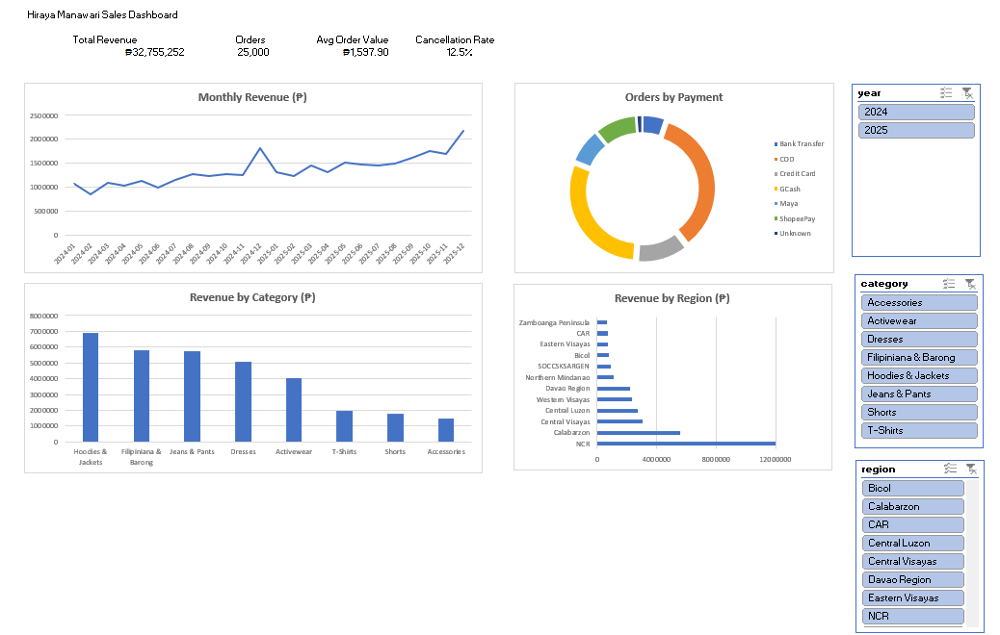

# Hiraya Manawari: Philippine E-Commerce Sales Analysis

An end-to-end sales analysis for a fictional Philippine online clothing store on a Shopee/Lazada-style marketplace. The project covers the full analyst workflow: generating messy data, cleaning it, modeling it in SQL, answering business questions with queries, and presenting the results in an interactive Excel dashboard.

> **Note:** All data in this project is synthetic (generated with Python) and does not represent a real business. Patterns in the data were designed to be realistic, but the findings below describe this simulated dataset only.



## The Business Problem

The store owner feels sales are slow and wants to understand the business: what sells, where, how customers pay, and when orders come in.

## Headline Numbers (Jan 2024 to Dec 2025)

| Total Revenue | Orders | Average Order Value | Cancellation Rate |
|---:|---:|---:|---:|
| ₱32,755,252 | 25,000 | ₱1,597.90 | 12.5% |

Revenue counts completed orders only and excludes shipping fees.

## Key Findings

1. **The business is growing.** Revenue rose about 31% from ₱14.2M in 2024 to ₱18.6M in 2025. December 2025 was the best month at ₱2.18M.
2. **Sale days work.** On 9.9, 10.10, 11.11 and 12.12 the store averaged 110 orders per day versus 27 on a normal day (4.1x), and 3.4x the daily revenue. Revenue per order is lower on sale days because of discounts.
3. **Cash on delivery (COD) is the biggest reliability problem.** COD is 34.5% of orders but 21.0% of them are cancelled, compared with 7% to 9% for GCash, Maya, ShopeePay, credit card, and bank transfer.
4. **Three categories drive over half of revenue.** Hoodies & Jackets, Filipiniana & Barong, and Jeans & Pants together make up 56% of revenue. Filipiniana & Barong sells fewer units than most categories but ranks second in revenue because its average price is about ₱1,592.
5. **Sales are concentrated in Metro Manila and nearby.** NCR alone is 36.6% of revenue and Calabarzon is 17.0%. Each Mindanao region is under 7%.
6. **Orders peak Friday to Sunday.** Sunday is the busiest day (16.1% of orders) and Wednesday is the slowest (12.5%).
7. **Customers do come back.** 66% of customers who ordered placed two or more orders. This is high because the data is simulated.

## Recommendations

- **Reduce COD cancellations:** offer a small discount or free shipping for e-wallet payment, and confirm COD orders by SMS before shipping.
- **Plan around sale days and December:** stock up and prepare logistics ahead of 9.9, 10.10, 11.11, 12.12, and the Christmas season.
- **Time promotions for Friday to Sunday** when order volume is highest.
- **Lift order value with add-ons:** Accessories are only 4% of revenue with an average price near ₱233, making them a good bundle item with higher-priced apparel.
- **Test marketing in Visayas and Mindanao,** where sales are low relative to the size of the market.

## Tools and Skills Demonstrated

| Area | What I did |
|---|---|
| Python (pandas, numpy) | Generated a realistic 25,000-order dataset with deliberate data quality problems; wrote a reproducible cleaning script |
| Data cleaning | Removed duplicates, standardized dates, city names, status and category text, handled missing values, fixed invalid prices, ran integrity checks |
| SQL (SQLite) | Designed a star-style schema with primary and foreign keys, CHECK rules, and indexes; wrote queries using JOINs, CTEs, window functions (RANK, LAG), CASE WHEN, and UNION ALL |
| Excel | Built PivotTables, calculated fields, KPI cards, charts, and slicers connected across multiple pivots |
| Git and GitHub | Version-controlled the project with clear commit history |

## Data Cleaning Summary

Every issue found and how it was fixed is documented in [`docs/cleaning_log.md`](docs/cleaning_log.md). Highlights:

- 150 duplicate orders removed
- 2,421 orders with non-standard date formats parsed into one format
- 1,000 status values and 1,422 city names standardized
- 300 missing payment methods labeled `Unknown` rather than guessed
- 40 zero or negative prices replaced with the product list price

## Database Design

| Table | Type | Description |
|---|---|---|
| `orders` | Fact | One row per order |
| `order_items` | Fact | One row per product in an order |
| `customers` | Dimension | City, province, region, signup date |
| `products` | Dimension | Product name, category, price |
| `dim_date` | Dimension | One row per day, with weekday, weekend, sale-day, and payday flags |

See [`sql/schema.sql`](sql/schema.sql) for the full design.

## Project Structure

```
hiraya-manawari-sales-dashboard/
├── README.md
├── data/
│   ├── raw/                 # messy generated data
│   └── cleaned/             # cleaned data
├── dashboard/
│   └── hiraya_manawari_dashboard.xlsx
├── docs/
│   ├── kpi_definitions.md   # business questions and KPI formulas
│   └── cleaning_log.md      # every data fix, documented
├── images/
│   └── dashboard.png
├── scripts/
│   ├── generate_data.py
│   ├── clean_data.py
│   └── build_database.py
└── sql/
    ├── schema.sql
    └── analysis/            # one query per business question
```

## How to Reproduce

```bash
pip install pandas numpy

python scripts/generate_data.py     # creates data/raw/
python scripts/clean_data.py        # creates data/cleaned/ and docs/cleaning_log.md
python scripts/build_database.py    # creates data/hiraya_manawari.db
```

Then open `data/hiraya_manawari.db` in [DB Browser for SQLite](https://sqlitebrowser.org/) and run the queries in `sql/analysis/`. The Excel dashboard is in `dashboard/`.

## Assumptions and Limitations

- The dataset is simulated, so conclusions are illustrative and not real business results.
- Revenue excludes shipping fees and counts only orders with status Completed.
- Missing payment methods are kept as `Unknown` to avoid inventing data.
- Zero or negative prices were replaced with the product's list price, which may slightly overstate revenue on sale days.
- Repeat customer rate is measured among customers who placed at least one order.

## Author

**[Your Name]** | [LinkedIn](https://www.linkedin.com/) | [GitHub](https://github.com/)
